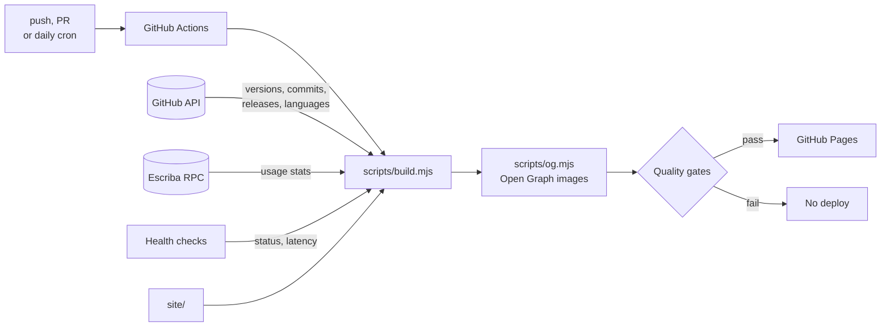

<div align="center">


# toniruiz.es

**Personal website of Toni Ruiz — Developer & DevOps in Barcelona.**

[](https://github.com/Favashi/toniruiz.es/actions/workflows/pages.yml)


[](https://favashi.github.io/toniruiz.es/data/lighthouse.json)

[**toniruiz.es**](https://toniruiz.es) · [English version](https://toniruiz.es/en/) · [GitHub Pages preview](https://favashi.github.io/toniruiz.es/)

</div>

---

## Overview

A fast, static, bilingual personal site that presents both sides of my work:
**development** (indigo) and **DevOps** (mint). It mixes an Apple-like layout with
Linux terminal details, including an interactive shell in the hero section.

It uses plain HTML, CSS and JavaScript, with no framework, bundler or `node_modules`.
A small Node script runs at build time, and a GitHub Actions workflow keeps the
content fresh every day.

## Features

- **Interactive terminal.** It types `whoami` and `neofetch` on load, then accepts
  commands: `help`, `skills`, `projects`, `kubectl get pods`, `git log`, `contact`,
  `cd <section>`, `status`, `lang`, `theme`, `clear`. It has history (↑/↓), Tab completion,
  tappable command buttons for mobile and a `/` shortcut to focus it. There are also a few
  secret commands for the curious (type `secrets` for hints).
- **Live data, baked into the HTML.** Every build collects:
  - from the **GitHub API**: versions, last update, recent commits, latest releases,
    language breakdown, and total commits, releases and CI workflows;
  - from **shallow clones** of the featured repos: lines of code and automated tests
    (pgTAP `plan(N)` + Playwright `test(`);
  - from **Escriba de la Marca's public RPC** (`landing_showcase`): catalogue size and
    books catalogued by its users.

  Everything is rendered into the page, so search engines and link previews see real
  numbers without running JS.
- **Bilingual.** Spanish lives at `/` and English at `/en/`, with `hreflang` alternates,
  a language switch and a localised terminal.
- **Light and dark themes.** The site follows the system theme, and a manual toggle
  persists the choice.
- **SEO and sharing.** Canonical URLs, Open Graph and Twitter cards with
  per-language 1200×630 images, JSON-LD (`Person`, `ProfilePage`, `WebSite`,
  `WebApplication`), a bilingual sitemap, `robots.txt`, a web manifest and icons.
- **Accessible and light.** The site has a skip link, semantic landmarks, a mobile menu,
  `prefers-reduced-motion` support and colour contrast that meets WCAG AA. Fonts are
  self-hosted latin subsets and images are WebP with lazy loading. It also works
  without JavaScript.
- **Language hint.** If the visitor's browser language does not match the page, a small
  dismissible prompt suggests the other version. It never redirects automatically.
- **Privacy-friendly analytics.** [GoatCounter](https://www.goatcounter.com) collects no
  cookies and no personal data. It counts page views, clicks on key links and which
  terminal commands people use (known commands only, never free text).

## Quality gates

Every push and pull request runs the full pipeline. Nothing is deployed unless all of
these pass:

| Check | Tool |
|---|---|
| HTML validity | [html-validate](https://html-validate.org) |
| Spanish and English pages stay structurally in sync | `scripts/check-i18n.mjs` |
| No broken links | [lychee](https://github.com/lycheeverse/lychee) |
| End-to-end tests on desktop and mobile (rendering, no console or CSP errors, terminal, menu, language switch, theme) | [Playwright](https://playwright.dev) |
| Accessibility, best practices and SEO ≥ 95, performance ≥ 90 | [Lighthouse CI](https://github.com/GoogleChrome/lighthouse-ci) |

The Lighthouse scores of each deploy are published in the footer of the site and in the
badge above. [Dependabot](.github/dependabot.yml) keeps the actions and tooling up to date.

Security: a strict Content-Security-Policy (inline scripts are allowed by hash only),
a referrer policy and [`/.well-known/security.txt`](https://toniruiz.es/.well-known/security.txt).

## How it works



`scripts/build.mjs` does the following:

1. Copies `site/` to `_site/`.
2. Fetches public data for an **allow-list** of repositories (`escribadelamarca`,
   `osr-manager`, `toniruiz.es`). It reads the latest release, the last push and the
   recent commits. Other repositories are never shown.
3. Injects the data into both pages through `data-gh` / `data-gh-time` attributes and
   the `<!-- gh:activity -->` block. It also exposes the data as JSON for the terminal.
4. Clones the featured repositories (shallow) to count lines of code and tests, and
   reads Escriba's public stats endpoint. The Supabase URL and publishable key are read
   from Escriba's own `js/config.js`, so they never drift.
5. Checks that the live apps respond (status code and latency) for the `status` and
   `kubectl get pods` terminal commands.
6. Downloads the current GitHub avatar, so the photo is never out of date.
7. Adds a content hash (`?v=…`) to CSS/JS URLs for safe cache busting.
8. Adds the Content-Security-Policy with the hash of the inline script, and writes
   `security.txt` with a fresh expiry date.
9. Writes `_site/data/github.json` and refreshes the dates in the sitemap.

`scripts/og.mjs` then renders the Open Graph images from `scripts/og/template.html`
with Playwright.

If the API is unavailable, the build still succeeds and publishes the static
fallback content.

## Project structure

```
.
├── site/                    # Source of the website (what gets published)
│   ├── index.html           # Spanish (default)
│   ├── en/index.html        # English
│   ├── 404.html
│   ├── assets/
│   │   ├── css/main.css     # Shared styles
│   │   ├── css/fonts.css    # @font-face for the self-hosted fonts
│   │   ├── fonts/           # Inter and JetBrains Mono (SIL OFL 1.1)
│   │   ├── js/main.js       # Theme, terminal, i18n strings, GitHub data
│   │   └── img/             # WebP screenshots and avatar
│   ├── og-image.png         # Social preview (es)
│   ├── og-image-en.png      # Social preview (en)
│   ├── sitemap.xml, robots.txt, site.webmanifest, icons…
├── scripts/
│   ├── build.mjs            # Build: copy, live data, avatar, CSP, security.txt
│   ├── og.mjs               # Open Graph images (template in og/template.html)
│   ├── check-i18n.mjs       # es/en structure check
│   ├── lighthouse-scores.mjs# Publishes Lighthouse scores
│   └── serve.mjs            # Tiny static server for local use and tests
├── tests/site.spec.js       # Playwright end-to-end tests
├── lighthouserc.json        # Lighthouse CI budgets
└── .github/
    ├── workflows/pages.yml  # Build, test and deploy (push, PR, daily, manual)
    └── dependabot.yml
```

## Local development

Requires Node.js 22 or newer. The site has no runtime dependencies; `npm ci` only
installs the build and test tooling.

```sh
npm ci
npx playwright install chromium

npm run build                       # build with live data (or: node scripts/build.mjs --offline)
npm run serve                       # http://localhost:8000
npm run ci                          # the full pipeline: build, OG, checks, tests, Lighthouse
```

Then open <http://localhost:8000> (Spanish) or <http://localhost:8000/en/> (English).

If you set `GITHUB_TOKEN`, the build uses it, which avoids the 60 requests/hour
limit for anonymous API calls.

## Editing content

- **Text:** edit `site/index.html` (es) and `site/en/index.html` (en). Keep the two in sync.
- **Terminal output:** edit the `I18N` object at the top of `site/assets/js/main.js`.
- **Featured repositories:** edit `PROJECTS` in `scripts/build.mjs`.
- **Styles:** edit `site/assets/css/main.css`. The colour tokens are defined at the top:
  `--dev` and `--ops` are the two accent colours.

## Deployment

The `pages.yml` workflow runs on every push to `main`, every day at 05:30 UTC and on
manual dispatch. It deploys `_site/` with the official GitHub Pages actions. Pages is
configured with **Source: GitHub Actions**.

To use the custom domain, add the GitHub Pages DNS records for `toniruiz.es`
(A/AAAA on the apex, plus a `www` CNAME to `favashi.github.io`). Then set the domain
under *Settings → Pages* and enable *Enforce HTTPS*.

## Credits

Fonts: [Inter](https://github.com/rsms/inter) and
[JetBrains Mono](https://github.com/JetBrains/JetBrainsMono), both under the
SIL Open Font License 1.1 (see `site/assets/fonts/`).

## Contact

**Toni Ruiz** · [info@toniruiz.es](mailto:info@toniruiz.es) ·
[GitHub](https://github.com/Favashi) · [LinkedIn](https://www.linkedin.com/in/toniruizfernandez)
