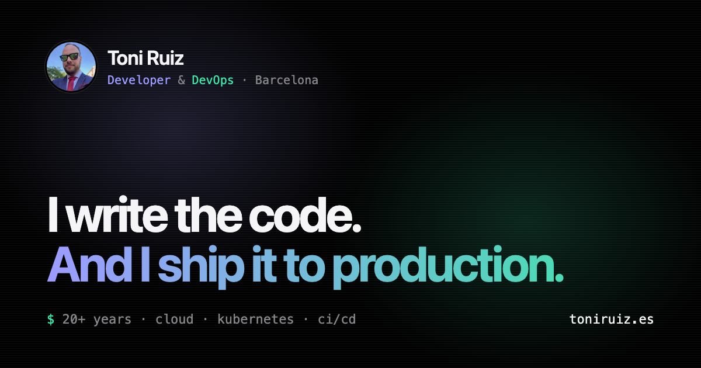
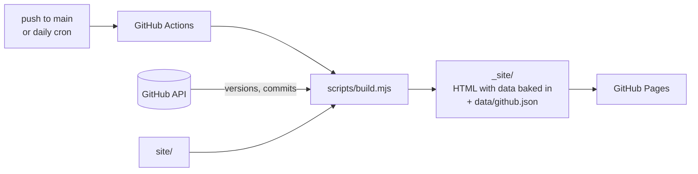

<div align="center">



# toniruiz.es

**Personal website of Toni Ruiz — Developer & DevOps in Barcelona.**

[](https://github.com/Favashi/toniruiz.es/actions/workflows/pages.yml)


[**toniruiz.es**](https://toniruiz.es) · [English version](https://toniruiz.es/en/) · [GitHub Pages preview](https://favashi.github.io/toniruiz.es/)

</div>

---

## Overview

A fast, static, bilingual personal site that presents both sides of my work:
**development** (indigo) and **DevOps** (mint). It mixes an Apple-like layout with
Linux terminal details, including an interactive shell in the hero section.

It uses plain HTML, CSS and JavaScript, with no framework, bundler or `node_modules`.
A small Node script runs at build time, and a GitHub Actions workflow keeps the
content fresh every day.

## Features

- **Interactive terminal.** It types `whoami` and `neofetch` on load, then accepts
  commands: `help`, `skills`, `projects`, `kubectl get pods`, `git log`, `contact`,
  `cd <section>`, `lang`, `theme`, `clear`. It has history (↑/↓) and Tab completion.
- **Live GitHub data, baked into the HTML.** The project versions, last update time and
  recent commits come from the GitHub API at build time. They are rendered into the
  page, so search engines and link previews see real content without running JS.
- **Bilingual.** Spanish lives at `/` and English at `/en/`, with `hreflang` alternates,
  a language switch and a localised terminal.
- **Light and dark themes.** The site follows the system theme, and a manual toggle
  persists the choice.
- **SEO and sharing.** Canonical URLs, Open Graph and Twitter cards with
  per-language 1200×630 images, JSON-LD (`Person`, `ProfilePage`, `WebSite`,
  `WebApplication`), a bilingual sitemap, `robots.txt`, a web manifest and icons.
- **Accessible and light.** The site has a skip link, semantic landmarks and
  `prefers-reduced-motion` support. Images are WebP with lazy loading, and it works
  without JavaScript.

## How it works



`scripts/build.mjs` does the following:

1. Copies `site/` to `_site/`.
2. Fetches public data for an **allow-list** of repositories (`escribadelamarca`,
   `osr-manager`, `toniruiz.es`). It reads the latest release, the last push and the
   recent commits. Other repositories are never shown.
3. Injects the data into both pages through `data-gh` / `data-gh-time` attributes and
   the `<!-- gh:activity -->` block. It also exposes the data as JSON for the terminal.
4. Writes `_site/data/github.json` and refreshes the dates in the sitemap.

If the API is unavailable, the build still succeeds and publishes the static
fallback content.

## Project structure

```
.
├── site/                    # Source of the website (what gets published)
│   ├── index.html           # Spanish (default)
│   ├── en/index.html        # English
│   ├── 404.html
│   ├── assets/
│   │   ├── css/main.css     # Shared styles
│   │   ├── js/main.js       # Theme, terminal, i18n strings, GitHub data
│   │   └── img/             # WebP screenshots and avatar
│   ├── og-image.png         # Social preview (es)
│   ├── og-image-en.png      # Social preview (en)
│   ├── sitemap.xml, robots.txt, site.webmanifest, icons…
├── scripts/build.mjs        # Build: copy + GitHub data injection
└── .github/workflows/
    └── pages.yml            # Build and deploy on push, daily and on demand
```

## Local development

Requires Node.js 20 or newer. There is nothing to install.

```sh
node scripts/build.mjs              # build with live GitHub data
node scripts/build.mjs --offline    # build without calling the API
python3 -m http.server -d _site 8000
```

Then open <http://localhost:8000> (Spanish) or <http://localhost:8000/en/> (English).

If you set `GITHUB_TOKEN`, the build uses it, which avoids the 60 requests/hour
limit for anonymous API calls.

## Editing content

- **Text:** edit `site/index.html` (es) and `site/en/index.html` (en). Keep the two in sync.
- **Terminal output:** edit the `I18N` object at the top of `site/assets/js/main.js`.
- **Featured repositories:** edit `PROJECTS` in `scripts/build.mjs`.
- **Styles:** edit `site/assets/css/main.css`. The colour tokens are defined at the top:
  `--dev` and `--ops` are the two accent colours.

## Deployment

The `pages.yml` workflow runs on every push to `main`, every day at 05:30 UTC and on
manual dispatch. It deploys `_site/` with the official GitHub Pages actions. Pages is
configured with **Source: GitHub Actions**.

To use the custom domain, add the GitHub Pages DNS records for `toniruiz.es`
(A/AAAA on the apex, plus a `www` CNAME to `favashi.github.io`). Then set the domain
under *Settings → Pages* and enable *Enforce HTTPS*.

## Contact

**Toni Ruiz** · [info@toniruiz.es](mailto:info@toniruiz.es) ·
[GitHub](https://github.com/Favashi) · [LinkedIn](https://www.linkedin.com/in/toniruizfernandez)
